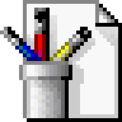
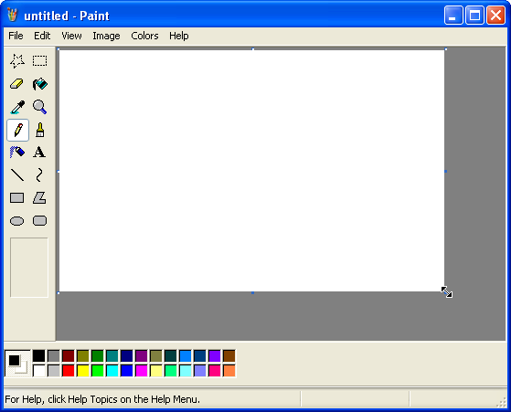

[![Contributors][contributors-shield]][contributors-url]
[![Forks][forks-shield]][forks-url]
[![Stargazers][stars-shield]][stars-url]
[![Issues][issues-shield]][issues-url]
[![MIT License][license-shield]][license-url]

<!-- PROJECT LOGO -->
<br />
<div align="center">
  <a href="https://github.com/CaravanaCloud/zpaint">
    
  </a>

  <h3 align="center">zPaint</h3>

  <p align="center">
    Paint Clone made with Zig and Raylib.
    <br />
  </p>
</div>

<!-- TABLE OF CONTENTS -->
<details>
  <summary>Table of Contents</summary>
  <ol>
    <li>
      <a href="#about-the-project">About The Project</a>
    </li>
    <li>
      <a href="#getting-started">Getting Started</a>
      <ul>
        <li><a href="#prerequisites">Prerequisites</a></li>
        <li><a href="#installation">Installation</a></li>
      </ul>
    </li>
    <li><a href="#roadmap">Roadmap</a></li>
    <li><a href="#contributing">Contributing</a></li>
    <li><a href="#license">License</a></li>
  </ol>
</details>

## About The Project



(_Illustrative image as placeholder_)

This project aims to replicate the classic MSPaint but made with Zig and Raylib, currently we are working on basic and fundamental feature such as Drawing and erasing basic strokes.

## Getting Started

This is an example of how you may give instructions on setting up your project locally.
To get a local copy up and running follow these simple example steps.

### Prerequisites

In order to build the project you need to have Zig 0.11.0 installed. You can check [this link](https://ziglang.org/learn/getting-started/#installing-zig) to read installation instructions for Windows, Mac or Linux.

### Installation

_Below is an example of how you can instruct your audience on installing and setting up your app. This template doesn't rely on any external dependencies or services._

1. Clone the repo
   ```sh
   git clone https://github.com/CaravanaCloud/zpaint/
   ```
2. Open the repository locally
   ```sh
   cd zpaint
   ```
3. Run zig build and run command
   ```sh
   zig build run
   ```

## Roadmap

- [ ] Basic drawing features
- [ ] Eraser
- [ ] Canvas size manipulation
- [ ] Color selection
- [ ] Selection tools
- [ ] Paint bucket
- [ ] Color picker
- [ ] Brush
- [ ] Spray
- [ ] Text
- [ ] Straight line
- [ ] Curved line
- [ ] Basic shapes

See the [open issues](https://github.com/CaravanaCloud/zpaint/issues) for a full list of proposed features (and known issues).

## Contributing

Contributions are what make the open source community such an amazing place to learn, inspire, and create. Any contributions you make are **greatly appreciated**.

If you have a suggestion that would make this better, please fork the repo and create a pull request.
Don't forget to give the project a star! Thanks again!

1. Fork the Project
2. Create your Feature Branch (`git checkout -b feature/AmazingFeature`)
3. Commit your Changes (`git commit -m 'Add some AmazingFeature'`)
4. Push to the Branch (`git push origin feature/AmazingFeature`)
5. Open a Pull Request

## License

Distributed under the MIT License. See `LICENSE` for more information.

<!-- MARKDOWN LINKS & IMAGES -->

[contributors-shield]: https://img.shields.io/github/contributors/CaravanaCloud/zpaint.svg?style=for-the-badge
[contributors-url]: https://github.com/CaravanaCloud/zpaint/graphs/contributors
[forks-shield]: https://img.shields.io/github/forks/CaravanaCloud/zpaint.svg?style=for-the-badge
[forks-url]: https://github.com/CaravanaCloud/zpaint/network/members
[stars-shield]: https://img.shields.io/github/stars/CaravanaCloud/zpaint.svg?style=for-the-badge
[stars-url]: https://github.com/CaravanaCloud/zpaint/stargazers
[issues-shield]: https://img.shields.io/github/issues/CaravanaCloud/zpaint.svg?style=for-the-badge
[issues-url]: https://github.com/CaravanaCloud/zpaint/issues
[license-shield]: https://img.shields.io/github/license/CaravanaCloud/zpaint.svg?style=for-the-badge
[license-url]: https://github.com/CaravanaCloud/zpaint/blob/master/LICENSE
